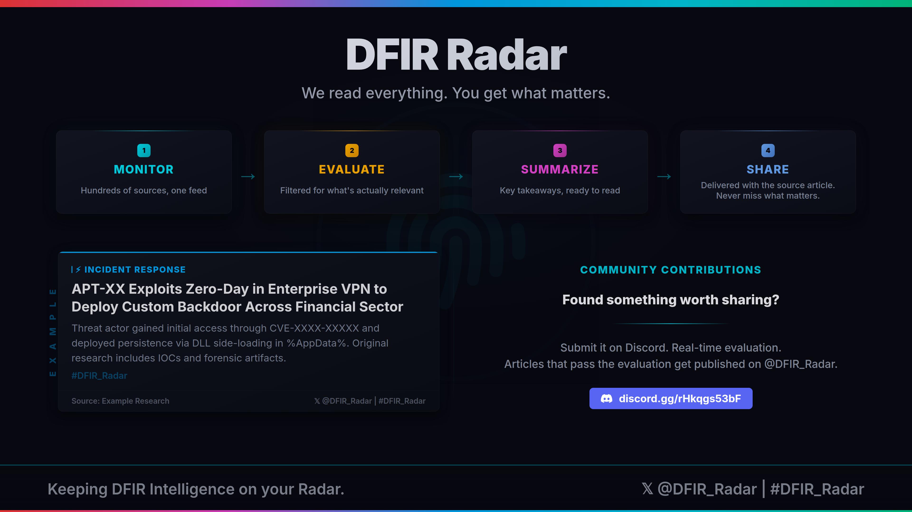

# DFIR Radar

*Keeping DFIR Intelligence on your Radar*

Hundreds of cybersecurity blogs, research reports, and advisories published every day. No one has time to read them all. And the one report that matters? It's buried somewhere in the noise.

We monitor the cybersecurity landscape around the clock. Every article is evaluated for DFIR relevance. Only what's genuinely useful makes it through. The rest never reaches your feed.

This feed is the result of that process. Every article is sourced, evaluated, and published only if it meets the standard.

*Built by a practitioner who needed this to exist.*



## RSS Feed

Subscribe to get DFIR Radar articles in your RSS reader, Teams/Slack bot, or any tool that supports RSS.

```
https://falhumaid.github.io/DFIR_Radar_RSS/rss.xml
```

## Connect

- **Follow on X** - [@DFIR_Radar](https://x.com/DFIR_Radar)
- **Join Discord** - [Contribute articles and join the community](https://discord.gg/rHkqgs53bF)

---

DFIR Radar - Keeping DFIR Intelligence on your Radar
